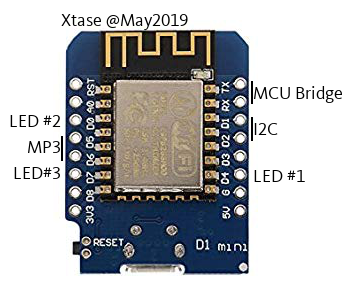

# Esp12 as SubMCU

**a) pinout**



- **RX,TX** bridge
- **D5, D6** (GPIO 14,12) SoftSerial DFPlayer
- **D1, D2** (GPIO A4,A5) I2C SX1509
- D? (GPIO ??) MP3 isPlaying INPUT --> have to use SX1509 ???
- **D4, D0, D7** (GPIO 2, 16, 13) LED OUTPUTs
- **RESERVED** GPIO 0,2,15 for flashing control / A0 Cf ESP.getVcc()


**b) check PWR**

from : <https://itechnofrance.wordpress.com/2018/01/14/nodemcu-entree-analogique-a0/>

ESP.getVcc() est utilisé pour lire la tension d’alimentation du Nodemcu. Rien ne doit être branché sur la pin A0. Pour effectuer cette mesure il est nécessaire de changer le mode de fonctionnement du convertisseur ADC en ajoutant la ligne ADC_MODE(mode) où mode peut-être ADC_TOUT (pour une lecture externe) ou ADC_VCC (pour la lecture de la tension d’alimentation du Nodemcu).

```c++
ADC_MODE(ADC_VCC);
void setup() {
  Serial.begin(115200);
}
void loop() {
  Serial.print(" Alimention(mV): ");
  Serial.println(ESP.getVcc());
  delay(300);
}
```


**c) commands**

- i -> infos **(to finish)**
- k -> read keyb buffer **(done)**
- w -> WiFi **(TODO)**
  - c : connect
    - s  : STA mode ( w/ SSID[] ) **(done)**
    - a : AP mode **(done)**
  - s : stop **(done)**
  - i : getIP **(written to be tested)**
  - e : getESSID **(written to be tested)**
  - t : telnet
    - o : open **(tested)**
    - c : close
  - g : get URL content (wget/curl like) **(tested)**
    - 2 ways returning result :
      - by KbdLine
      - by WriteRam of a pre-allocated string (passed as input param of BdosCall)
- l -> led control **(to finish : kbPoll deactivates LEDs for now)**
  - 000 -> RGB all OFF
  - 010 -> -G- only green is ON
- v -> Voltage Control **(to finish : calibrate)**
  - 2.98 on Pocket w/o pwr supply -> 2.96 w/ (Pocket & surfacePro3...)
- p -> mp3 control **(to finish : isPlaying() )**
  - p -> play track
  - ...