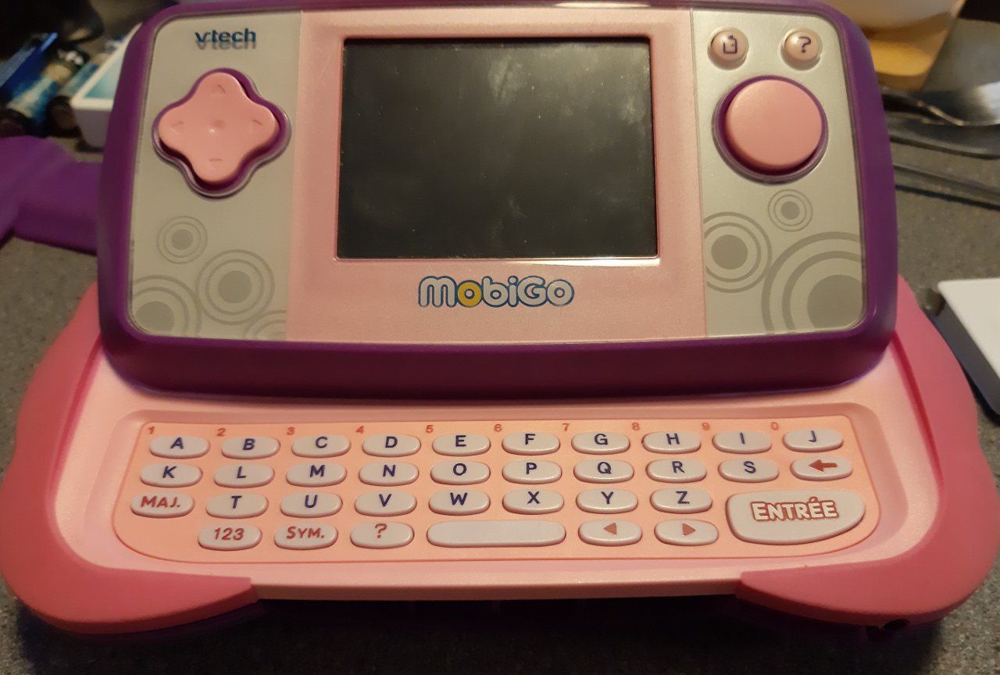
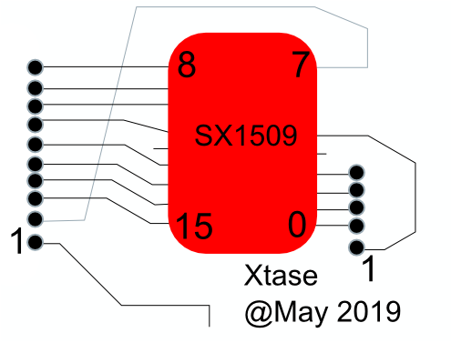
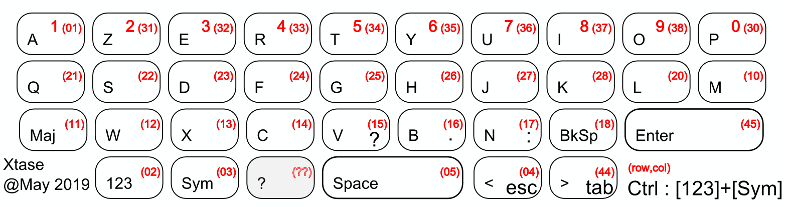

## Reuse of Vtech Mobigo Gaming Console

### Sliding console with Keyboard

**Keyboard**

  - 10 cols x 5 rows matrix Keyboard w/ 35 keys
  - @ this time : 9x5 really useable for 34 keys
  - driven by an SX1509 GPIO I2C expander
    - 5rows as OUTPUT
    - 10cols as INPUT (no pullUp)
- 
    - Behavior to read 1 key :
      - send HIGH for only 1 ROW
      - read each COL input
        - send LOW for that ROW
      - gives a ROW,COL address
- 
- **Symbols for CP/M**
     - : . \n \b \s + " ? / "
     - Symb + N -> ':' **(done)**
     - Symb + B -> '.' **(done)**
     - Symb + V -> '?' **(done)**
     - Symb + < -> 'Esc' **(done)**
     - Symb + > -> 'Tab' **(done)**
     - now able to type c:xtsdemo.pas
  - TODO : 
    - add RGB led for 3 metaKeys states (**added 3 leds config**)
    

**Teensy 3.6/3.2 Yatl pinout** 

**I2C : ** 0 -> 18(sda) & 19(scl) (not used by SPI TFT)

**SPI Screen :**

    // w/ that lib BOTH CS & DC needs to besome CS pins
    #define _TFT_DC  20
    #define _TFT_CS  15
    // #define TFT_SCK 14 // doesn't work !!!!
    #define TFT_SCK 13
    
    #define TFT_MOSI 11
    #define TFT_MISO 12
    #define TFT_RST  17
    #define TFT_LED  16