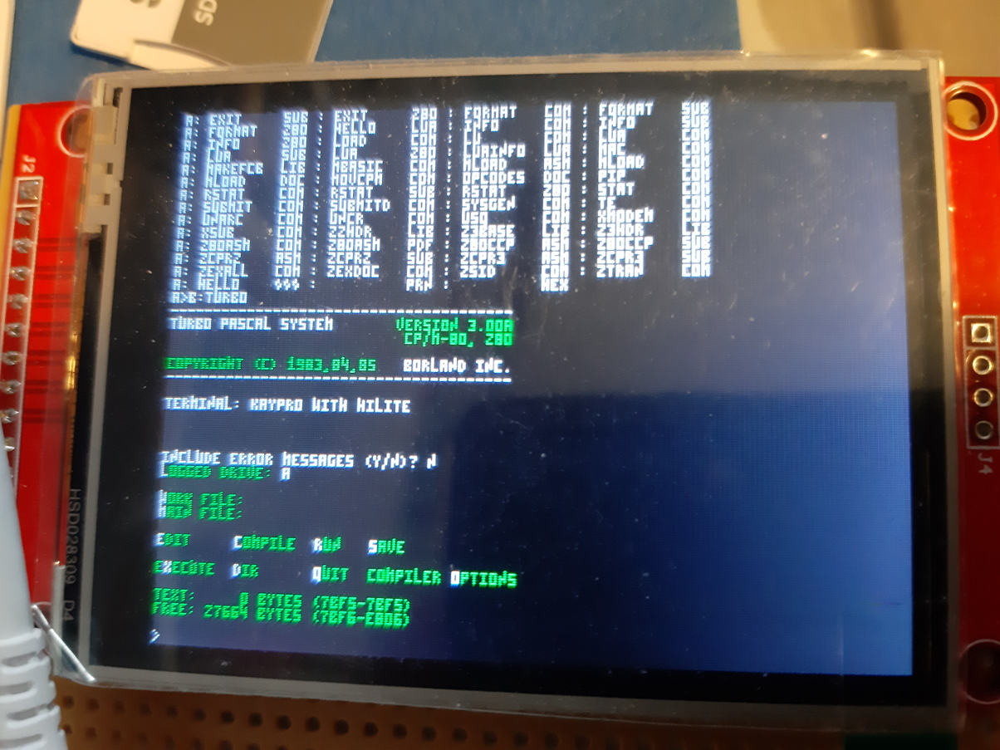

## Xts CP/M

( just an **unoffical** fork of the excelent [RunCPM](https://github.com/MockbaTheBorg/RunCPM) that was did by MockbaTheBorg )

**You should rather take a look @ [official implementation](https://github.com/MockbaTheBorg/RunCPM).** 

Xtase - fgalliat version @ Apr2109

**Aim** : run interpreters on Teensy 3.6 (& even a small OS)

**WANTED :**

  **Additionals commands** (should be intrinsic) to execute some Hardware Native functions

  in order to add <u>CP/M - impossible</u> behaviors : 

- send files to/from SDCard (emulated DRIVEs or other ex. /Z/0/WALLPAPER.BMP ) (take a look @ **XMODEM.COM** anyway but uses LST: ? unsuable for now)

- activate / disactivate WiFi

- some of these behaviors could be emulated by **spe-memseg-addr** to be used in other CP/M programs

  - or BASIC or Pascal own-written softwares (ex. play buzzer tunes, WiFi control, acceed to DFPlayer...)
  - **working way** : BdosCall + VT-EXT

- see **./ArduinoInterface/** **samples** (.BAS, .PAS, .ASM) that can deal w/ **digital/analog arduino pins** and some other BDOS improvements ...

- from Pascal **BdosCall** :
  - Hooked interrupt 225, that can receive an address of a String of 255 chars. wide ! **(done)**

    

**Current/Initial compilation :**
  On a Teensy 3.6
  Sketch uses 73184 bytes (6%) on 1048576 bytes (+1MB).
  Global vars uses 72436 bytes (27%) of RAM, still 189708 free for local vars. max is 262144 bytes (~262KB).

  - enough RAM & Flash remaining to add some hardware supports 

  - **debug @ 9600bps / default** => setted to **115200bps** for YATL now

  - with VT100 console & BUZZER support & BMP image support
    Sketch uses 97476 bytes (9%) on 1048576.
    Global vars uses 85148 octets (32%) of RAM,

**Layer impl.**

- video
  - builtin TFT ILI9341 320x240x64K
    - **inMem console** (6x8 -> 53x30chars) // (3+1x5+1 -> 80x40chars)
    - the TinyFont mode is enough (80x25chars required)
    - **VT100 emulation** ( for colors + clrscr cmd + locate cmd ) **to finish**
    - EXT : could have **gfx** (even if OS itself is text based only)
      - currently have **.BMP wallpaper support** working
    - EXT : could have **native-animated-gfx** routines (Starfield, Raycast frame, 3D-Balls, ....) 
  - EXT : HobbyTronics Serial-To-VGA (text-only) board
  - EXT : Teensy ++2 (5v) as TVOut device (gfx + text w/ enough RAM to handle descent resolutions)
- keyboard
  - **Vetch Mobigo** console builtin keyboard [see docs here](./Mobigo/README.md)
  - **XBOX 360 Chatpad** Serial builtin keyboard
  - EXT : HobbyTronics USB Host board for Keyboard
- audio
  - PCSpeaker-like to play tunes (ex. play "MONKEY.T5K", play "aa#cd" ) **done**
  - MP3 tracks playback via DFPlayer (w/ pause, volume settings, ...) **done**
- WiFi
  - start / stop AP/client
  - manage a telnet server
  - manage a simple webIDE (may use builtin SDCARD to store resources...)
  - wget some URLs ...
- find a way to call ext. hardware
  - **currently working** : BdosCall (usable in Pascal, Basic, ...)
    - 225 to 229 are free (able to send a Pascal String[255] to a Bdos interrupt)
  - specific **virtual FDD for assets**, Z: (as original CP/M ends to P:), to store .BMP, .T5K, ...
  - CP/M itself could have additionals intrinsic commands 
  - may could by poke() on specific mem address
  - Current CCP uses 60KB of RAM -> 4KB remains to make the stuff !?
    - 'cause if uses 60KB that means that mem pointers are 16bit long
    - so could address 64KB of mem ( /!\\ BEWARE of BIOS & BDOS location /!\\ )
  - look @ 2x PseudoFiles that can deals w/ Printers&Devices (PUN: & LST:) ....

**Software**

- Pascal IDE (text)
  - tpas30.zip
  - http://www.z80.eu/pas-compiler.html
  - online compiller : https://rextester.com/l/pascal_online_compiler
  - another one : https://www.jdoodle.com/execute-pascal-online
- mBASIC
  - 40KB RAM available when launched
  - https://archive.org/stream/BASIC-80_MBASIC_Reference_Manual/BASIC-80_MBASIC_Reference_Manual_djvu.txt
- Google Search
  - https://www.google.com/search?q=program+for+cp%2Fm&oq=program+for+cp%2Fm

**Runs on**

  - Teensy 3.6 (Yeah !)
  - 'nux (ARM64 - Android's chrooted kali - native cpp) / (PC x64 ubuntu Linux)
  - Android (Dalvik nor NDK : <u>Not yet Ported</u>)

**How to run**

 - **Teensy 3.6**
   - copy CCP/* @ sdcard:/
   - unzip DISK/A.zip to sdcard:/A/
   - then boot (each DISK letter is a folder of ONE letter)
   - 
  - **'Nux Box**
      - make posix build
        - needs libreadline-dev + ncurses-dev
      - make a ./distro/ directory
       - copy CCP/* to ./distro/
       - unzip DISK/A.zip to ./distro/A/0/
       - copy RunCPM executable ELF to ./distro/
       - then boot : cd ./distro && ./RunCPM (each DISK letter is a folder of ONE letter)

**Usefull commands :**

- **EXIT**
- **XMODEM**
- **TYPE** READ.ME
- **SUBMIT** TOTO.SUB (to run a ~batch script)
- **FORMAT** D: (will create & format a virtual disk w/ user 0)
- **DIR** *.BAS
- **REN**
- **ERA** *.TMP (delete one or more files)
- **SCHED** (to run a program later...)
- **LOAD** (run a .HEX file or compile it as a .COM file)
- **Z80ASM** TITI.ASM (to compile a .ASM to a .COM, see INFO.ASM & other samples on DISK A:)
- **TE** TOTO.TXT (text editor)
- **PIP** save.txt=orig.txt (to copy a file)

**Usefull links :**

- https://github.com/MockbaTheBorg/RunCPM
- http://www.z80.eu/pas-compiler.html (that provides versions of Pascal language for CPM)
- https://fr.wikipedia.org/wiki/Control_Program/Monitor

**Current stage :**

@ Xtase - fgalliat :: Apr2019