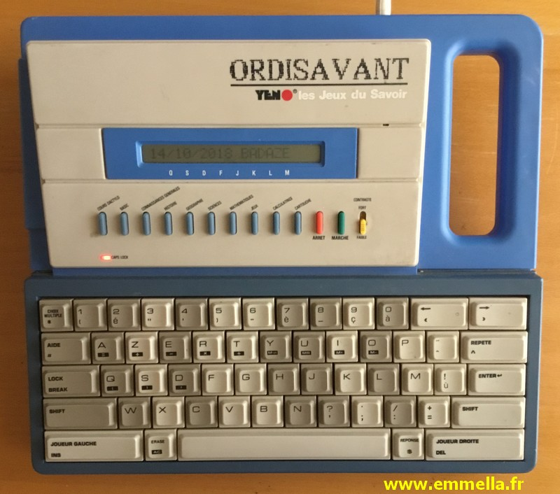

# YENO OrdiSavant (1988) mod.

- based on ESP32 devkit R1 board
- ILI9341 320x240 TFT Screen w/ SDCard reader (2.8 " ?? or 3.5 ??)
  - look if I have not a 4" screen in ILI chip type ....? (if 640x480 -> check speed & make a pixel shader...)
  - I think I have de devStripBoard w/ just ESP32 + ILI + Serial ....
- DFPlayer MP3 playback module
- MCP23017 I2C GPIO for keyboard decoding (MP3 /BUSY reading)
- Buzzer
- YatlCPM distro ( compilled for ESP8266 w/ spe. Yatl arch (w/o MCU bridge) )
- see if shared SPI for Screen / TFCard isn't too slow ....?
  - be sure that used Screen DOES share the SPI ( if need 2 distincts ... :-( )
  - will just requires 2 CS lines (Screen/TF)
- no Bridged MCU (all on one chip)
- CPM + GFX + WiFi + MP3 + Keyb
- Startup HOOK for YatlCPM (AUTOEXEC String)
  - if do not find any Entry Point -> use Keyboard buffer & firstUse flag
  - then type content of AUTOEXEC value (could be stored in EEPROM or FS)
  - it's a command-String not an executable
  - so can be "A:MBASIC", "A:MBASIC MENU", "C:GFXDEMO.COM"
- it could be cool to use pseudoLCD consoleColorSet + Big font @ start then launch MBASIC.... (even if keep TURBO3 for after boot-time)
- MCU :: ESP32 - 2x240MHz / 320KB ram / 4MB flash (1MB sketch storage ?)
- Left has Extension port ...
- as used BIG BATTERY-PACKS -> could place a BIG rechargable USB BATT. (up to 5000MAh)

