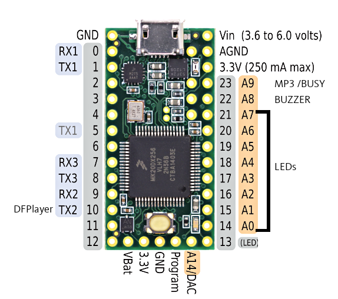
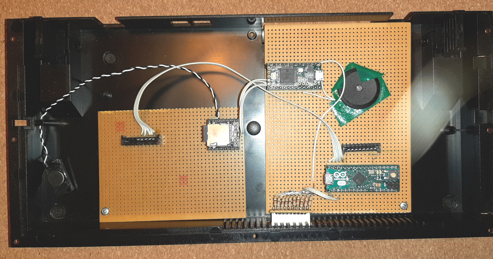

# Xts RPI0W - Arduino- ZX SPECTRUM +

02 Jan 2020

Xtase - fgalliat


**ZX Spectrum+ unit**


**Arduino Keyboard decoder**


**ZXTS SubMCU wiring**



**ZTXS Both Arduinos + DFPlayerMP3**



- [x] wire the keyboard matrix (Arduino MICRO)
  
  - [x] test arduino MICRO code
  - [x] remap sereval keyCodes ...
  - [x] manage debouce & repeat again
  - [x] wire @least 2 leds for keyb state (CapLock & Ctrl)
  
- [ ] RPI deactivate Serial debugging (**later** : will use T3.2 SubMCU via USBSerial for now)

- [x] mount a subMCU (T3.2 connected by USB)
  - [x] mount a DFPlayer on subMCU
  
  - [x] mount a Buzzer on SubMCU
    
    - [x] reserve 5KB RAM for tunefiles
    
  - [x] mount a 10LED BarGraph (could address 8 by T3.2 + 2 by MICRO (keyb) )
    - [ ] BOOT
    - [ ] DRIVE
    - [ ] WIFI
    - [ ] CAP LOCK
    - [ ] Ctrl key
    
  - [ ] ? mount an I2C 128x32 monochrome screen ?
  
  - [ ] ```
    == SubMCU Protocol ==
    
    @		PING => '@'					PING THE MODULE					[x]
    
    lxy		LED x{0..7} y{0..1}			SWITCH ON/OFF 1 LED				[x]
    Lx		LEDs x{0..255}				SWITCH MASK   8 LEDs			[x]
    
    b		BEEP						EMIT a single beep				[x]
    Bxxyy	BEEP x{freqOrNote}{durMS}	TONE a sound (0..48 : notes)    [x]
    q{str}	PLAY STRING "A#CCD"			PLAY a notes sequence           [x]
    t{bin}  PLAY TUNE T5K				PLAYS a T5K tune file           [x]
    T{bin}  PLAY TUNE T53				PLAYS a T53 tune file           [x]
    
    p		(UN)PAUSE MP3				PAUSE MP3 PLAYBACK           	[x]
    Pxx		PLAY MP3 x{1..999}			PLAY MP3 TRACK           		[x]
    Xxx		LOOP MP3					LOOP MP3 TRACK           		[x]
    S		STOP MP3					STOP MP3 PLAYBACK           	[x]
    vx		VOLUME x{0..30}				SET MP3 VOLUME           		[x]
    M		IS PLAYING ? => {0..1}		ASK IF MP3 BUSY                 [x]
    N		Next						PLAY NEXT TRACK                 [x]
    V		preVious					PLAY PREV. TRACK           		[x]
    
    ```
  
- [ ] mount USB HUB

- [ ] ? mount card reader ?

- [ ] wire HDMI output

- [ ] wire RCA output

- [ ] wire USB ext.

- [ ] add a WebFileEditor (httpd) as WiFiServerMode (directly linked to YatlCPM FS)

