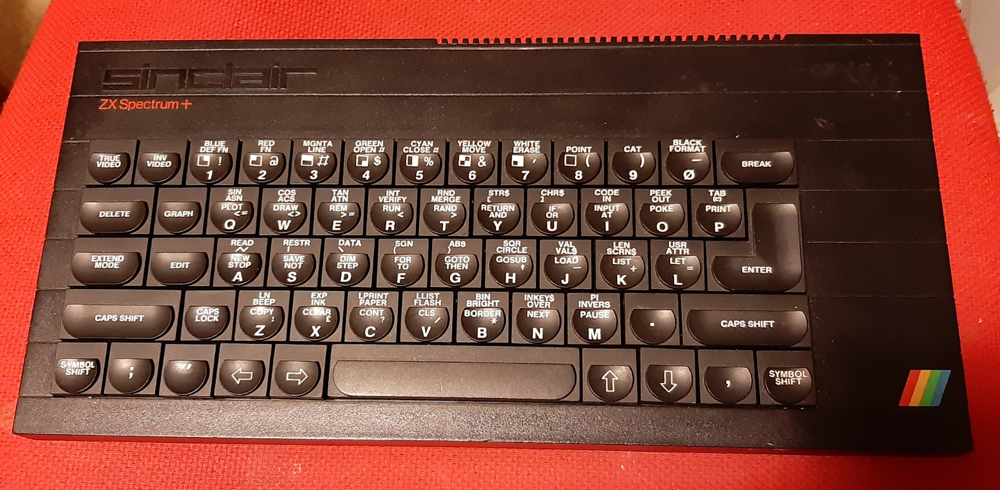
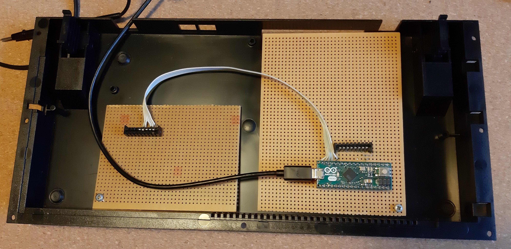

# Xts RPI0W - Arduino- ZX SPECTRUM +

02 Jan 2020

Xtase - fgalliat

**ZX Spectrum+ unit**

**Arduino Keyboard decoder**

- [x] wire the keyboard matrix (Arduino MICRO)
  - [x] test arduino MICRO code
  - [x] remap sereval keyCodes ...
  - [x] manage debouce & repeat again
  - [ ] wire @least 2 leds for keyb state (CapLock & Ctrl)
- [ ] RPI deactivate Serial debugging
- [ ] mount a subMCU
  - [ ] mount a DFPlayer on subMCU
  - [ ] mount a Buzzer on SubMCU
    - [ ] reserve 5KB RAM for tunefiles
- [ ] mount USB HUB
- [ ] ? mount card reader ?
- [ ] wire HDMI output
- [ ] wire RCA output
- [ ] wire USB ext.