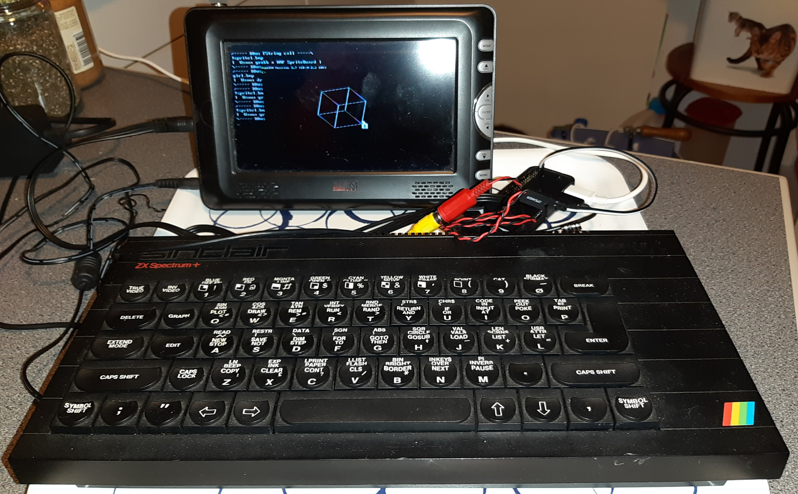

# Xts RPI0W - Arduino- ZX SPECTRUM +

02 Jan 2020

Xtase - fgalliat

**ZX Spectrum+ unit**

**Arduino Keyboard decoder**

- [x] wire the keyboard matrix (Arduino MICRO)
  - [x] test arduino MICRO code
  - [x] remap sereval keyCodes ...
  - [x] manage debouce & repeat again
  - [ ] wire @least 2 leds for keyb state (CapLock & Ctrl)
- [ ] RPI deactivate Serial debugging (**later** : will use T3.2 SubMCU via USBSerial)
- [ ] mount a subMCU (T3.2 connected by USB)
  - [ ] mount a DFPlayer on subMCU
  - [ ] mount a Buzzer on SubMCU
    - [ ] reserve 5KB RAM for tunefiles
  - [ ] mount a 10LED BarGraph (could address 8 by T3.2 + 2 by MICRO (keyb) )
    - [ ] BOOT
    - [ ] DRIVE
    - [ ] WIFI
    - [ ] CAP LOCK
    - [ ] Ctrl key
  - [ ] ? mount an I2C 128x32 monochrome screen ?
- [ ] mount USB HUB
- [ ] ? mount card reader ?
- [ ] wire HDMI output
- [ ] wire RCA output
- [ ] wire USB ext.

